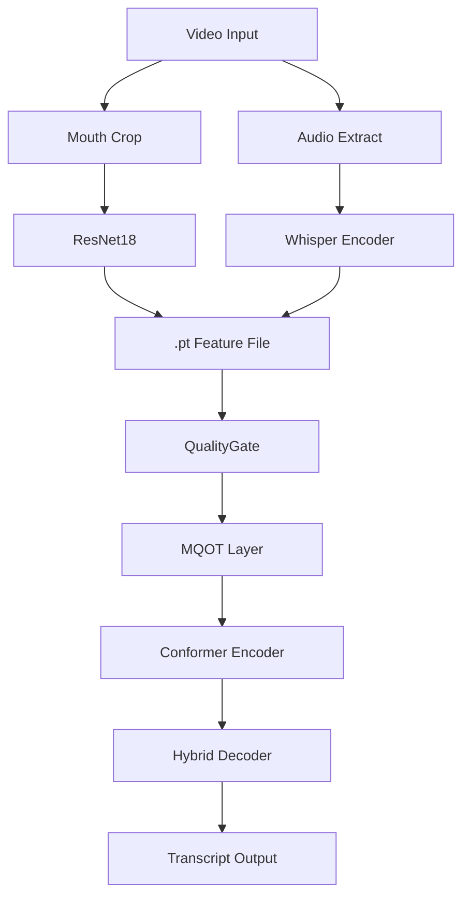
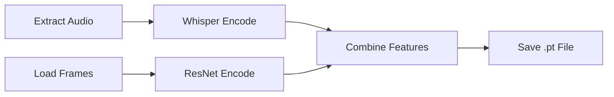
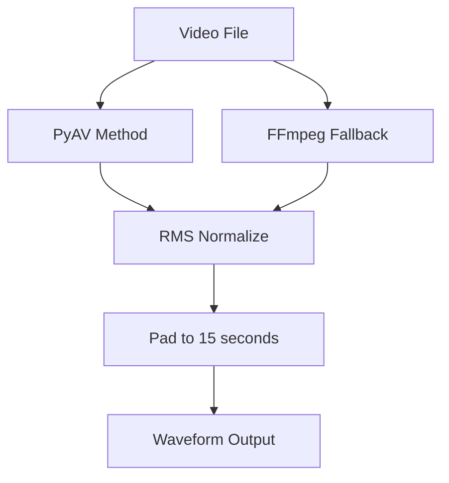
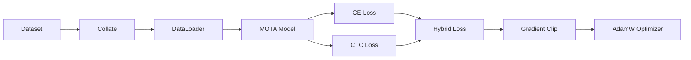
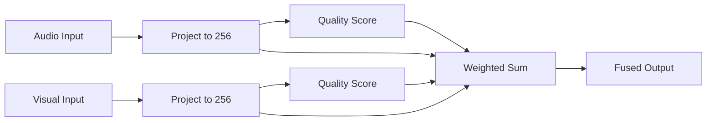
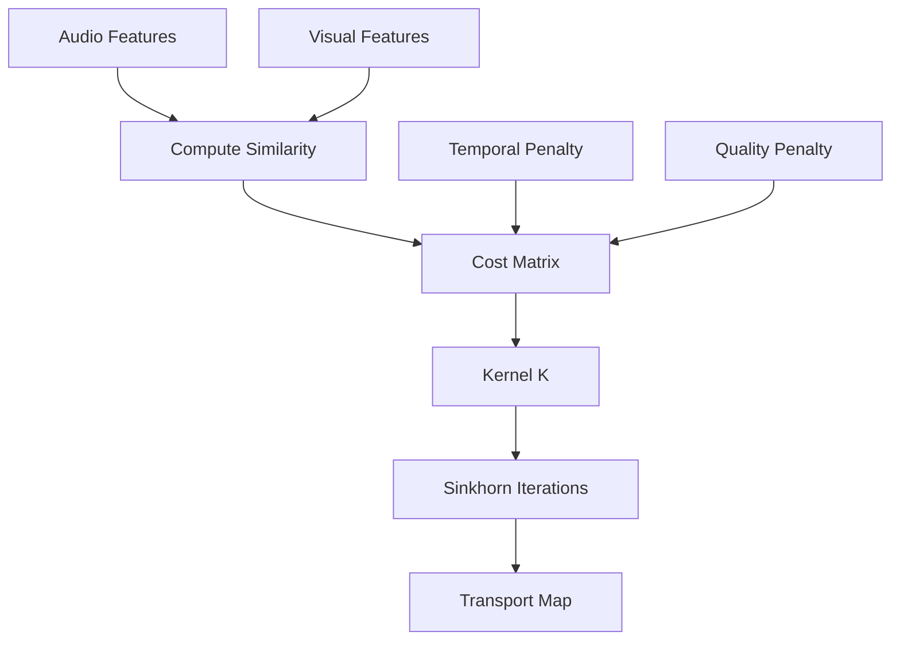

# MOTA: Multi-modal Optimal Transport Alignment for AVSR

An Audio-Visual Speech Recognition system with two-phase training:
- **Phase 1**: QualityGate for coarse fusion
- **Phase 2**: MQOT for fine-grained alignment

---

## Table of Contents

1.  [Architecture](#1-architecture)
2.  [Feature Extractors](#2-feature-extractors)
3.  [Preprocessing](#3-preprocessing)
4.  [Training](#4-training)
5.  [Fusion](#5-fusion)
6.  [Formulas](#6-formulas)
7.  [Project Structure](#7-project-structure)
8.  [Usage](#8-usage)

---

## 1. Architecture

### 1.1 System Overview



### 1.2 Data Flow

| Stage | Input | Output | Tool |
|-------|-------|--------|------|
| Crop | Video | Mouth ROI | FaceAlignment |
| Audio | Video | Waveform | FFmpeg |
| Audio Feat | Waveform | T x 768 | Whisper |
| Visual Feat | Frames | T x 512 | ResNet18 |
| Fusion | A + V | T x 256 | QualityGate |
| Decode | Features | Logits | Conformer |

---

## 2. Feature Extractors

### 2.1 Whisper (Audio)


**Specs:**

| Item | Value |
|------|-------|
| Model | whisper-small |
| Input | 16kHz, 15s |
| Mel | 80 x 3000 |
| Output | 1500 x 768 |

### 2.2 ResNet18 (Visual)


**Specs:**

| Item | Value |
|------|-------|
| Model | resnet18 |
| Input | 88 x 88 RGB |
| Output | 512-dim |

---

## 3. Preprocessing

### 3.1 Pipeline Stages

**Stage 1: CROP**


**Stage 2: EXTRACT**



### 3.2 Mouth Detection


**Landmark IDs:** 13, 14, 61, 291, 78, 308, 324, 17

**Formulas:**
```
cx = mean(x_coords)
cy = mean(y_coords)
r = max(width, height) * 0.9
```

**Optimization:** Detect every 5 frames, reuse bbox.

### 3.3 Audio Extraction



**FFmpeg Command:**
```bash
ffmpeg -i input -ar 16000 -ac 1 -f wav pipe:1
```

---

## 4. Training

### 4.1 Training Flow



### 4.2 Two Phases

**Phase 1: Baseline Training**


**Phase 2: MQOT Refinement**


**Phase 1 Config:**
- use_mqot = false
- lr = 3e-4
- batch = 32

**Phase 2 Config:**
- use_mqot = true
- lr = 1e-4
- batch = 16

---

## 5. Fusion

### 5.1 QualityGate



**Formula:**
```
q_a = sigmoid(MLP(audio))
q_v = sigmoid(MLP(visual))
alpha = q_a / (q_a + q_v)
fused = alpha * audio + (1-alpha) * visual
```

### 5.2 MQOT Layer



**Cost Matrix:**
```
C = -similarity + λ_time * temporal + λ_quality * quality
```

**Params:**
- λ_time = 0.5
- λ_quality = 5.0
- epsilon = 0.15
- iterations = 20

---

## 6. Formulas

### 6.1 Hybrid Loss

```
L = α * L_CTC + β * L_CE
```

| Epoch | α | β |
|-------|---|---|
| 1-5 | 0.7 | 0.3 |
| 6-15 | 0.5 | 0.5 |
| 16+ | 0.3 | 0.7 |

### 6.2 CTC Loss

```
L_CTC = -log P(Y|X)
P(Y|X) = sum over alignments
```

### 6.3 Sinkhorn Algorithm

```
K = exp(-C / ε)

repeat n times:
    u = 1 / (K @ v)
    v = 1 / (K.T @ u)

P = diag(u) @ K @ diag(v)
```

### 6.4 RMS Normalization

```
RMS = sqrt(mean(x²))
x_norm = x * (0.1 / RMS)
```

---

## 7. Project Structure

```
├── configs/
│   ├── phase1_base.yaml
│   └── phase2_mqot.yaml
├── scripts/modal/
│   ├── preprocess.py
│   ├── train_phase1.py
│   └── train_phase2.py
├── src/
│   ├── data/
│   │   ├── preprocessors/
│   │   ├── datasets/
│   │   ├── loader.py
│   │   └── collate.py
│   ├── models/
│   │   ├── layers/
│   │   ├── fusion/
│   │   └── mota.py
│   ├── training/
│   │   ├── trainer.py
│   │   └── losses.py
│   └── evaluation/
└── guides/
    └── ADDING_NEW_DATASET.md
```

---

## 8. Usage

### 8.1 Install

```bash
pip install torch transformers timm jiwer face-alignment
pip install modal && modal token new
```

### 8.2 Preprocess

```bash
# Crop mouth regions
modal run scripts/modal/preprocess.py --stage crop --dataset grid

# Extract features
modal run scripts/modal/preprocess.py --stage extract --dataset grid
```

### 8.3 Train

```bash
# Phase 1: Baseline
modal run scripts/modal/train_phase1.py

# Phase 2: MQOT
modal run scripts/modal/train_phase2.py
```

### 8.4 Config

| Param | P1 | P2 |
|-------|----|----| 
| use_mqot | false | true |
| batch | 32 | 16 |
| lr | 3e-4 | 1e-4 |

---

## References

- [Adding New Dataset](guides/ADDING_NEW_DATASET.md)
