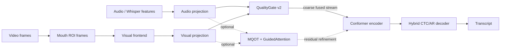

<div align="center">

# MOTA AVSR

**Multimodal Optimal Transport Alignment for Vietnamese audio-visual speech recognition**

[](https://www.python.org/)
[](https://pytorch.org/)
[](https://modal.com/)
[](https://wandb.ai/)
[](#project-status)

</div>

MOTA AVSR is a thesis-oriented research codebase for Vietnamese audio-visual speech recognition
(AVSR). It studies how to combine Whisper-style audio features and mouth-region video frames under
clean and noisy conditions, with a focus on reliability-aware fusion and optional optimal-transport
alignment.

The current system is built around two ideas:

- **QualityGate v2**: coarse audio-visual fusion with reliability estimates and soft gating.
- **MQOT**: optional fine-grained alignment using unbalanced Sinkhorn optimal transport.

> [!IMPORTANT]
> This is an experimental research repository, not a production ASR package. Reported numbers should
> be tied to a checkpoint, config, and evaluation protocol. For thesis tables, use the full evaluator
> in [`scripts/modal/eval_phase1.py`](scripts/modal/eval_phase1.py).

## Table of Contents

- [Project Status](#project-status)
- [Highlights](#highlights)
- [At a Glance](#at-a-glance)
- [Method Overview](#method-overview)
- [Repository Layout](#repository-layout)
- [Setup](#setup)
- [Data](#data)
- [Pretrained Visual Frontend](#pretrained-visual-frontend)
- [Training](#training)
- [Verification and Evaluation](#verification-and-evaluation)
- [Local Tests](#local-tests)
- [Modal Operations](#modal-operations)
- [Known Caveats](#known-caveats)
- [References and Related Projects](#references-and-related-projects)

## Project Status

| Area | Current state |
|---|---|
| Main runtime | Modal GPU functions and Modal volume storage. |
| Data path | ViCocktail-style WebDataset shards with `audio.pth`, `video.pth`, and `txt`. |
| Baseline path | QualityGate / lipvis training configs are available. |
| Visual branch | Still being bootstrapped; visual-only decoding is a diagnostic, not the final objective. |
| MQOT path | Implemented as Phase 2 continuation; useful only when visual features carry signal. |
| Tests | Fast unit tests cover masking, CTC lengths, resume behavior, visual frontend, RGF, and WebDataset IO. |

## Highlights

- Vietnamese AVSR pipeline using ViCocktail-style WebDataset frame shards.
- Frozen Whisper audio features plus visual frame encoding.
- Optional lip-reading visual frontend with Conv3D stem + ResNet trunk.
- Quality-aware fusion, optional Router-Gated Fusion, and optional MQOT refinement.
- Hybrid CTC + autoregressive decoder.
- Robust training utilities: modality dropout, deterministic noisy dev, full-state resume,
  AMP scaler restore, warmup restore, and W&B resume-safe logging.
- Modal-first training, verification, evaluation, backup, and restore scripts.
- Unit tests for masking, CTC lengths, resume behavior, visual frontend, RGF, and WebDataset IO.

## At a Glance

| Item | Description |
|---|---|
| Task | Vietnamese AVSR under clean and noisy test conditions. |
| Inputs | Precomputed audio features plus mouth-crop frame tensors. |
| Fusion | QualityGate v2, optional Router-Gated Fusion, optional MQOT refinement. |
| Decoder | Hybrid CTC + autoregressive decoder. |
| Training style | Staged configs with checkpoint resume and Modal relaunches. |
| Main commands | [`scripts/modal/train_phase1.py`](scripts/modal/train_phase1.py), [`scripts/modal/train_phase2.py`](scripts/modal/train_phase2.py), [`scripts/modal/eval_phase1.py`](scripts/modal/eval_phase1.py). |

Quick local sanity check:

```bash
python3.10 -m venv venv
source venv/bin/activate
pip install -r requirements.txt
venv/bin/python -m pytest tests/unit -q
```

Quick Modal smoke test:

```bash
modal run scripts/modal/train_phase1.py \
  --config-path /root/configs/phase_lipvis_smoke.yaml
```

## Method Overview


```mermaid
flowchart LR
    V[Video frames] --> ROI[Mouth ROI frames]
    ROI --> VF[Visual frontend]
    A[Audio / Whisper features] --> AP[Audio projection]
    VF --> VP[Visual projection]

    AP --> QG[QualityGate v2]
    VP --> QG

    QG -->|coarse fused stream| ENC[Conformer encoder]

    AP -. optional .-> MQOT[MQOT + GuidedAttention]
    VP -. optional .-> MQOT
    MQOT -. residual refinement .-> ENC

    ENC --> DEC[Hybrid CTC/AR decoder]
    DEC --> TXT[Transcript]
```

### Core components

| Component | File | Purpose |
|---|---|---|
| MOTA model | [`src/models/mota.py`](src/models/mota.py) | End-to-end model wiring. |
| QualityGate v2 | [`src/models/fusion/quality_gate.py`](src/models/fusion/quality_gate.py) | Cross-attention alignment and soft reliability fusion. |
| MQOT | [`src/models/fusion/mqot.py`](src/models/fusion/mqot.py) | Unbalanced Sinkhorn transport plan for audio-visual alignment. |
| RGF / NRQE | [`src/models/fusion/router_gate.py`](src/models/fusion/router_gate.py), [`src/models/fusion/nrqe.py`](src/models/fusion/nrqe.py) | Optional reliability routing extension. |
| Lip-reading frontend | [`src/models/visual/lipreading_frontend.py`](src/models/visual/lipreading_frontend.py) | Conv3D + ResNet visual frontend for raw mouth frames. |
| Decoder | [`src/models/layers/decoders.py`](src/models/layers/decoders.py) | CTC + AR decoder heads. |
| Trainer | [`src/training/trainer.py`](src/training/trainer.py) | Training loop, resume, auxiliary losses, logging, validation. |

## Current Training Tracks

The repository contains several configs because the project uses staged experiments rather than a
single monolithic run.

| Config | Intent |
|---|---|
| [`configs/phase1.yaml`](configs/phase1.yaml) | QualityGate-only baseline on WebDataset frame shards. |
| [`configs/phase2.yaml`](configs/phase2.yaml) | MQOT-enabled continuation from Phase 1. |
| [`configs/phase_lipvis.yaml`](configs/phase_lipvis.yaml) | Lip-reading frontend cold start with noisy dev and gradual visual unfreeze. |
| [`configs/phase_lipvis_force.yaml`](configs/phase_lipvis_force.yaml) | Force visual participation with visual-only auxiliary loss. |
| [`configs/phase_lipvis_visual_bootstrap.yaml`](configs/phase_lipvis_visual_bootstrap.yaml) | Adds direct visual CTC supervision. |
| [`configs/phase_lipvis_noisy_av.yaml`](configs/phase_lipvis_noisy_av.yaml) | Stronger noisy-AV training after visual bootstrap. |
| `*_smoke.yaml` | Cheap Modal smoke tests for a mechanism before a real run. |

Important interpretation: this project is **AVSR**, not pure visual speech recognition. Visual-only
decoding is a diagnostic; the primary question is whether AV beats audio-only under the same
evaluation condition.

## Repository Layout

```text
.
├── assets/                 # Tokenizer assets
├── configs/                # YAML experiment configs
├── docs/                   # Setup and Modal operating notes
├── guides/                 # Dataset extension guide
├── scripts/
│   ├── local/              # Local smoke/data utilities
│   └── modal/              # Modal training, preprocessing, eval, volume tools
├── src/
│   ├── data/               # Datasets, WebDataset shards, collate, tokenizers, augmentation
│   ├── evaluation/         # Decoding, metrics, visualization
│   ├── infra/              # Shared Modal images and volumes
│   ├── models/             # MOTA, fusion modules, visual frontend, decoder layers
│   ├── training/           # Trainer, loss, run entrypoint
│   └── utils/              # Config/device/checkpoint/logging helpers
├── tests/unit/             # Fast unit tests
└── verification/           # Local visual verification artifacts
```

The `thesis/` directory is intentionally ignored in Git on this branch. Keep thesis drafts and
temporary LaTeX builds out of code commits unless you deliberately decide otherwise.

## Setup

The Modal workflow is the source of truth for full training. Local setup is mainly for tests,
smoke checks, and editing.

```bash
python3.10 -m venv venv
source venv/bin/activate
pip install -r requirements.txt
```

Modal authentication:

```bash
pip install modal
modal token new
modal profile current
```

W&B is attached by the training Modal functions, so the `wandb` secret must exist even when a
config later disables W&B logging:

```bash
modal secret create wandb WANDB_API_KEY=<your-wandb-key>
```

See [`docs/SETUP.md`](docs/SETUP.md) for the full Modal, volume, secret, Google Drive backup,
and train/eval operating guide.

## Data

The current training path expects WebDataset shards on Modal volume:

```text
/mnt/vicocktail_features/
  vicocktail-avvn-train-*.tar
  vicocktail-avvn-test-000000-*.tar
  vicocktail-avvn-test_snr_<snr>_interferer_<n>-000000-*.tar
```

Each sample stores:

- `audio.pth`: precomputed Whisper features.
- `video.pth`: mouth-crop frame tensor.
- `txt`: transcript.

The reader lives in [`src/data/shards.py`](src/data/shards.py). It supports single glob strings
and lists of globs, so train/dev splits can be expressed directly in YAML.

## Pretrained Visual Frontend

The lip-reading frontend weights are stored on the Modal volume:

```bash
modal run scripts/modal/upload_lrw_frontend.py
modal run scripts/modal/check_visual_frontend.py --relu-type swish
```

The pre-flight check validates that the checkpoint loads, features are finite, temporal variation is
non-degenerate, and clips are distinguishable before starting a real training run.

## Training

All commands are run from the repository root.

### Phase 1 / lipvis

```bash
modal run --detach scripts/modal/train_phase1.py \
  --config-path /root/configs/phase_lipvis.yaml \
  --spawn --max-epochs-per-run 1
```

Use `--spawn` together with `--detach` for long background jobs. Relaunch the same command to resume
from the latest checkpoint in the configured checkpoint directory.

### Force visual participation

```bash
modal run scripts/modal/train_phase1.py \
  --config-path /root/configs/phase_lipvis_force_smoke.yaml

modal run --detach scripts/modal/train_phase1.py \
  --config-path /root/configs/phase_lipvis_force.yaml \
  --spawn --max-epochs-per-run 1
```

### Visual CTC bootstrap

```bash
modal run scripts/modal/train_phase1.py \
  --config-path /root/configs/phase_lipvis_visual_bootstrap_smoke.yaml

modal run --detach scripts/modal/train_phase1.py \
  --config-path /root/configs/phase_lipvis_visual_bootstrap.yaml \
  --spawn --max-epochs-per-run 1
```

### Phase 2 with MQOT

```bash
modal run --detach scripts/modal/train_phase2.py \
  --config-path /root/configs/phase2.yaml
```

Make sure the config matches the checkpoint architecture. For example, a checkpoint trained with
`use_mqot: true` must be evaluated or resumed with an MQOT-enabled config.

## Verification and Evaluation

Fast modality ablation on a checkpoint:

```bash
modal run scripts/modal/verify_lipvis.py \
  --checkpoint /mnt/checkpoints/lipvis_force_visual/epoch_3.pt \
  --config-path /root/configs/phase_lipvis_force.yaml \
  --limit 1000
```

This reports:

- AV decoding.
- audio-only: visual stream zeroed.
- visual-only: audio stream zeroed.
- optional visual-CTC-direct WER when the visual CTC head exists.

Full 9-condition evaluation:

```bash
modal run --detach scripts/modal/eval_phase1.py \
  --checkpoint /mnt/checkpoints/lipvis/best_model.pt \
  --config-path /root/configs/phase_lipvis.yaml \
  --decode greedy
```

The full evaluator writes JSON to `/mnt/eval/` on the Modal volume. Use it for thesis tables and
avoid mixing numbers from different eval protocols.

## Local Tests

Use the repository venv, not the system Python:

```bash
venv/bin/python -m compileall -q src scripts tests
venv/bin/python -m pytest tests/unit -q
```

Expected status at the time this README was rewritten:

```text
100 passed, 2 warnings
```

## Modal Operations

Common commands:

```bash
modal volume ls avsr-volume /checkpoints
modal volume ls avsr-volume /vicocktail_features | head
modal app list
modal app stop <app-id>
```

Backup and restore:

```bash
modal run scripts/modal/backup_to_gdrive.py --dry-run
modal run scripts/modal/backup_to_gdrive.py
modal run scripts/modal/restore_from_gdrive.py --dry-run
```

For details and gotchas, read [`docs/SETUP.md`](docs/SETUP.md).

## Development Notes

- Keep code changes and thesis drafts in separate commits.
- Do not commit checkpoints, WebDataset shards, raw media, W&B runs, Modal artifacts, or LaTeX build
  outputs.
- `thesis/` is ignored on this branch.
- Add an explicit `LICENSE` file before treating the repository as redistributable open-source code.
- Use `git diff --check` before committing.
- Prefer small mechanism-level smoke configs before launching long Modal jobs.
- Treat visual-only WER as a diagnostic, not as the main success metric.

## Known Caveats

- The visual branch is difficult to train from limited Vietnamese AV data. Expect audio to dominate
  early checkpoints.
- MQOT is an alignment/refinement mechanism; it is not a substitute for a visual frontend that has no
  usable signal.
- Noisy-dev augmentation is a proxy. Final claims should use the baked-noise test shards and the
  full evaluation script.
- W&B step logging uses `global_step` to make resumed runs readable; do not compare old runs unless
  their logging protocol is known.

## References and Related Projects

The README structure follows two kinds of references:

GitHub presentation references: clear first screen, badges, quick start, table of contents, status,
installation, usage, and caveats.

- [Awesome README](https://github.com/matiassingers/awesome-readme)
- [Best README Template](https://github.com/othneildrew/Best-README-Template)
- [Ultralytics](https://github.com/ultralytics/ultralytics)
- [Segment Anything](https://github.com/facebookresearch/segment-anything)

Speech and research-code references: abstract, installation, examples, model/recipe information,
and citation near the top:

- [OpenAI Whisper](https://github.com/openai/whisper)
- [ESPnet](https://github.com/espnet/espnet)
- [fairseq](https://github.com/facebookresearch/fairseq)

Research context:

- AV-HuBERT: Self-Supervised Learning of Audio-Visual Speech Representations
- Robust Self-Supervised Audio-Visual Speech Recognition
- ViCocktail: Vietnamese Cocktail Party Audio-Visual Speech Recognition

## Citation

If you use this repository in a thesis report or derived experiment, cite the relevant upstream
models and datasets in addition to this codebase:

```bibtex
@misc{mota_avsr,
  title  = {MOTA AVSR: Multimodal Optimal Transport Alignment for Vietnamese AVSR},
  author = {Project contributors},
  year   = {2026},
  note   = {Research code}
}
```
