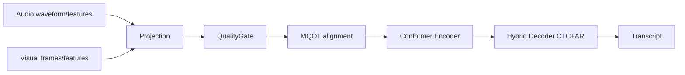
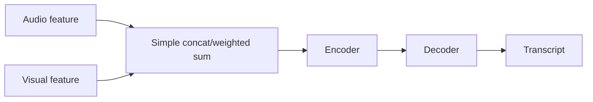
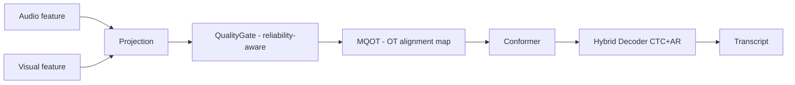
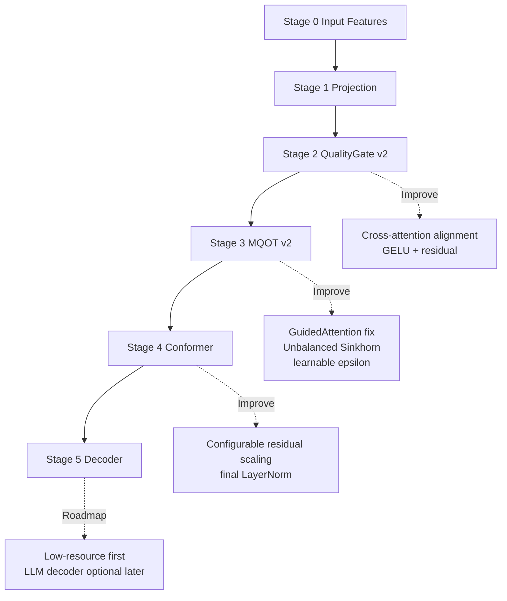
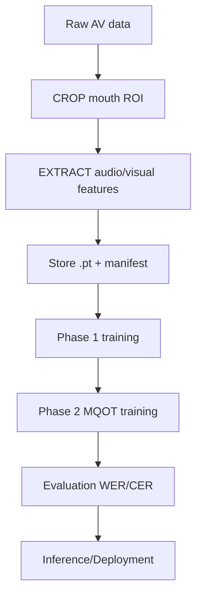

# MOTA AVSR — Tổng quan ý tưởng thuật toán & hệ thống (bản dạy nhanh)

## 1) Bài toán

Mục tiêu là xây dựng hệ thống **Audio-Visual Speech Recognition (AVSR)** cho tiếng Việt:

- Nhận **âm thanh + hình ảnh khẩu hình**
- Xuất ra **văn bản transcript**
- Vận hành tốt trong điều kiện thực tế (nhiễu âm, che miệng, lệch pha A/V)

---

## 2) Pain points & Bottlenecks

### 2.1 Pain points dữ liệu

1. **Dữ liệu AV đồng bộ chất lượng cao còn thiếu** (đặc biệt low-resource language như tiếng Việt)
2. **Frame rate mismatch** giữa audio và video (Ta != Tv)
3. **Độ nhiễu thực tế cao**: tiếng nền, góc mặt nghiêng, blur, che miệng

### 2.2 Pain points mô hình

1. Fusion “đẹp trên paper” nhưng dễ vỡ khi một modality kém chất lượng
2. Thiếu cơ chế ước lượng **độ tin cậy theo thời gian** cho từng modality
3. Alignment audio-visual còn yếu nếu chỉ dùng nội suy thời gian đơn giản

### 2.3 Bottleneck hệ thống

1. Tiền xử lý video (face/mouth crop) dễ thành nút thắt hiệu năng
2. Pipeline nhiều bước nên dễ mismatch format/shape tensor
3. Chi phí GPU/CPU tăng nhanh nếu config tài nguyên không hợp lý

---

## 3) Mục tiêu phần này

Tài liệu này tập trung mô tả:

- **Kiến trúc tổng thể**
- **Flow xử lý**
- **Các thành phần chính**
- **Logic thuật toán cốt lõi**

> Không đi sâu implementation code.

---

## 4) Input / Output

### Input

- Audio waveform (hoặc audio features đã trích xuất)
- Video frames vùng miệng (hoặc visual features đã trích xuất)
- (Train) Ground-truth text tokens

### Output

- Chuỗi token/văn bản transcript
- (Train) Các giá trị loss: CTC, CE, và các metric WER/CER

### Diagram: Input -> Output tổng thể

---

## 4.1 Baseline cũ vs Kiến trúc hiện tại

### Baseline trước đây (simple AV fusion)

**Đặc điểm baseline cũ:**

- Fusion tĩnh hoặc heuristic, ít cơ chế reliability theo frame
- Alignment A/V yếu khi `T_audio != T_visual`
- Dễ giảm chất lượng khi một modality nhiễu mạnh

### Kiến trúc hiện tại (MOTA)

**Thay đổi chính so với baseline:**

1. Thêm **QualityGate** để fusion động theo độ tin cậy
2. Thêm **MQOT** để sửa lệch đồng bộ A/V
3. Dùng **Hybrid CTC+AR** để cân bằng alignment và ngôn ngữ
4. Thiết kế tối ưu cho dữ liệu thực tế nhiều nhiễu

---

## 4.2 New Architecture Targets (2026 SOTA) — theo stage

| Stage | Nội dung       | Thay đổi so với cũ                                            |
| ----- | -------------- | ------------------------------------------------------------- |
| 0     | Input features | Giữ nguyên                                                    |
| 1     | Projection     | Giữ nguyên                                                    |
| 2     | QualityGate v2 | Interpolation -> cross-attention, ReLU -> GELU, thêm residual |
| 3     | MQOT v2        | GuidedAttention fix, Unbalanced Sinkhorn, learnable epsilon   |
| 4     | Conformer      | Residual scaling configurable, final LayerNorm                |
| 5     | Decoder        | Ưu tiên low-resource; LLM decoder là option sau               |

---

## 4.3 Flow triển khai thực tế (data + training)

---

## 4.4 Vì sao kiến trúc mới tốt hơn baseline?

| Vấn đề baseline                            | Thành phần mới         | Tác động                                     |
| ------------------------------------------ | ---------------------- | -------------------------------------------- |
| Fusion tĩnh, không biết modality nào nhiễu | QualityGate            | Fusion động theo chất lượng từng frame       |
| Lệch đồng bộ A/V                           | MQOT                   | Cải thiện alignment khi Ta != Tv             |
| Decoder một nhánh dễ mất cân bằng          | Hybrid CTC+AR          | Vừa mạnh alignment vừa giữ ngữ cảnh ngôn ngữ |
| Dễ vỡ trên dữ liệu thực tế                 | Reliability + OT logic | Robust hơn trong noise/blur/occlusion        |

---

## 4.5 Mục tiêu của kiến trúc hiện tại

1. **Mục tiêu ngắn hạn:** chạy ổn định end-to-end với phase 1/2
2. **Mục tiêu trung hạn:** giảm WER/CER trên noisy Vietnamese AVSR
3. **Mục tiêu dài hạn:** nâng cấp dần lên hướng SOTA (sparse alignment, router-gated, sync-aware pretraining)

---

## 4.6 Ghi chú về hướng LLM decoder

- Với bài toán hiện tại ưu tiên **low-resource + cost efficiency**, decoder chính vẫn là hybrid CTC+AR.
- **LLM-based decoder** để ở hướng mở rộng sau, khi có thêm dữ liệu/tài nguyên và cần benchmark nâng cao.

---

## 5) Các module chính

1. **Preprocessing / Feature Preparation**
   - Tách audio, crop mouth ROI
   - Trích xuất đặc trưng audio/visual (hoặc load precomputed `.pt`)

2. **Projection Layer**
   - Audio 768 -> d_model
   - Visual 512 -> d_model

3. **QualityGate (Coarse Fusion)**
   - Ước lượng độ tin cậy audio/visual
   - Trộn hai modality theo trọng số động

4. **MQOT (Fine Alignment/Fusion)**
   - Dùng ý tưởng Optimal Transport để căn chỉnh audio-visual khi lệch thời gian
   - Sinh transport map làm tín hiệu hướng dẫn hợp nhất

5. **Conformer Encoder**
   - Mã hóa ngữ cảnh theo thời gian

6. **Hybrid Decoder (CTC + AR)**
   - CTC branch cho alignment mạnh
   - AR branch cho ngôn ngữ/chuỗi token mượt hơn

7. **Training/Evaluation Engine**
   - Hybrid loss
   - Decoding + WER/CER

---

## 6) Luồng xử lý (pipeline / workflow)

## 5) Các module chính

1. **Preprocessing / Feature Preparation**
   - Tách audio, crop mouth ROI
   - Trích xuất đặc trưng audio/visual (hoặc load precomputed `.pt`)

2. **Projection Layer**
   - Audio 768 -> d_model
   - Visual 512 -> d_model

3. **QualityGate (Coarse Fusion)**
   - Ước lượng độ tin cậy audio/visual
   - Trộn hai modality theo trọng số động

4. **MQOT (Fine Alignment/Fusion)**
   - Dùng ý tưởng Optimal Transport để căn chỉnh audio-visual khi lệch thời gian
   - Sinh transport map làm tín hiệu hướng dẫn hợp nhất

5. **Conformer Encoder**
   - Mã hóa ngữ cảnh theo thời gian

6. **Hybrid Decoder (CTC + AR)**
   - CTC branch cho alignment mạnh
   - AR branch cho ngôn ngữ/chuỗi token mượt hơn

7. **Training/Evaluation Engine**
   - Hybrid loss
   - Decoding + WER/CER

---

## 6) Luồng xử lý (pipeline / workflow)

## 6.1 Workflow tổng quát

1. Nhận input audio + video
2. Tiền xử lý / load features
3. Chiếu về cùng không gian đặc trưng (projection)
4. Coarse fusion bằng QualityGate
5. Fine alignment bằng MQOT
6. Encode bằng Conformer
7. Decode bằng Hybrid decoder
8. Xuất transcript (inference) hoặc tính loss/metric (training)

## 6.2 Workflow huấn luyện 2 pha

- **Phase 1 (Baseline):** tập trung học fusion cơ bản + decode ổn định
- **Phase 2 (MQOT):** bật/nhấn mạnh module OT để cải thiện alignment khó

---

## 7) Ý tưởng thuật toán cốt lõi

### 7.1 Reliability-aware fusion

Thay vì giả định audio và visual luôn tốt như nhau, hệ thống học:

- Frame nào audio đáng tin hơn
- Frame nào visual đáng tin hơn

=> Fusion động theo thời gian, tăng robustness khi một modality suy giảm.

### 7.2 OT-based cross-modal alignment (MQOT)

Khi Ta != Tv, dùng tư duy Optimal Transport để:

- Xây cost matrix giữa audio frame và visual frame
- Tính transport plan/map
- Dùng map này để dẫn hướng attention/fusion

=> Giảm lỗi do lệch đồng bộ audio-video.

### 7.3 Hybrid decoding objective

Kết hợp:

- **CTC loss**: tốt cho bài toán alignment
- **CE/AR loss**: tốt cho sinh chuỗi token ngữ pháp hơn

=> Cân bằng giữa tính ổn định alignment và chất lượng ngôn ngữ đầu ra.

---

## 8) Logic tổng thể (ngắn gọn)

- Nếu dữ liệu sạch và đồng bộ: model chạy như AVSR chuẩn
- Nếu audio nhiễu: tăng trọng số visual qua cơ chế quality-aware
- Nếu visual yếu (blur/occlusion): dựa nhiều hơn vào audio
- Nếu lệch thời gian A/V: MQOT điều chỉnh map liên kết trước khi decode

=> Hệ thống ưu tiên **robustness thực chiến** thay vì chỉ tối ưu benchmark sạch.

---

## 9) Công nghệ sử dụng (optional)

- **PyTorch** (model/training)
- **Transformers (Whisper tokenizer/encoder ecosystem)**
- **Conformer / Multi-head attention**
- **Optimal Transport (Sinkhorn-style alignment idea)**
- **Modal (hạ tầng chạy preprocessing/training từ xa)**

---

## 10) Template dạy nhanh cho sinh viên

> The proposed system takes **[input]** as input and produces **[output]**.
> It consists of **[modules/components]**.
> The workflow includes **[steps]**.
> The core algorithm is based on **[method]**.
> This design ensures **[advantage]**.

### Điền mẫu cho MOTA AVSR

- The proposed system takes **audio-visual speech features** as input and produces **Vietnamese transcript text**.
- It consists of **preprocessing, projection, QualityGate fusion, MQOT alignment, Conformer encoder, and Hybrid decoder**.
- The workflow includes **feature preparation -> fusion -> alignment -> encoding -> decoding -> evaluation**.
- The core algorithm is based on **reliability-aware multimodal fusion and optimal transport-based alignment**.
- This design ensures **better robustness under noise, occlusion, and A/V mismatch**.

---

## 11) Ví dụ theo từng hướng (gợi ý làm seminar/đồ án)

### Hướng A — Low-resource AVSR cho tiếng Việt

- Trọng tâm: tăng hiệu quả với ít dữ liệu
- Ý tưởng: transfer learning + text normalization + lightweight decoder
- KPI: WER/CER trên tập nhiễu và tập sạch

### Hướng B — Synchronization correction trước fusion

- Trọng tâm: sửa lệch pha audio-video
- Ý tưởng: MQOT/OT alignment map trước decoder
- KPI: giảm lỗi ở mẫu có drift thời gian

### Hướng C — Reliability estimation theo thời gian

- Trọng tâm: đo chất lượng từng modality theo frame
- Ý tưởng: QualityGate động + confidence-aware routing
- KPI: robustness khi audio nhiễu hoặc video che miệng

### Hướng D — Pipeline thực chiến tối ưu chi phí

- Trọng tâm: triển khai chạy thật
- Ý tưởng: tách preprocess/training, tối ưu GPU-CPU-memory config
- KPI: thời gian xử lý / chi phí / độ ổn định job

---

## 12) Kết luận

MOTA AVSR là kiến trúc kết hợp:

- **Fusion có ý thức độ tin cậy**
- **Alignment bằng OT**
- **Decode hybrid CTC+AR**

Mục tiêu chính không chỉ là điểm benchmark, mà là đạt độ bền vững khi triển khai trong dữ liệu tiếng Việt thực tế nhiều nhiễu và bất định.
